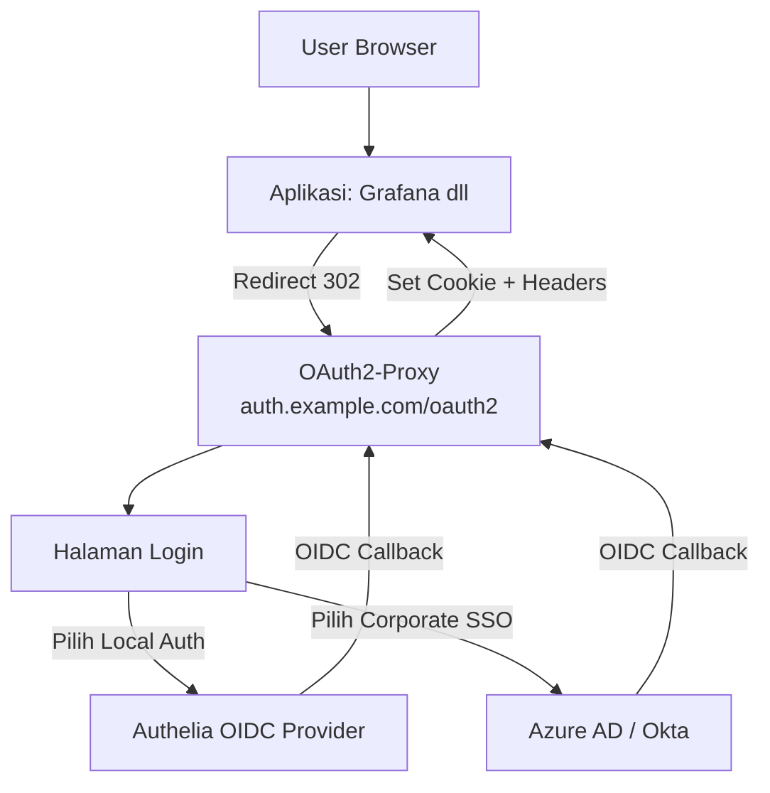

# OAuth2-Proxy

[OAuth2-Proxy](https://oauth2-proxy.github.io/oauth2-proxy/) adalah authentication gateway yang diletakkan di depan aplikasi web untuk menangani autentikasi. Mendukung **multiple OIDC providers** sehingga bisa melayani:

- **Local user** → Authelia (SSO internal)
- **Corporate user** (`@internal-company.com`) → External IDP (Azure AD / Okta)

## Arsitektur



### Alur Lengkap

1. User membuka aplikasi (misal `grafana.example.com`)
2. Aplikasi mendeteksi belum ada session → redirect ke `auth.example.com/oauth2/sign_in`
3. OAuth2-Proxy menampilkan halaman login dengan pilihan provider
4. User memilih **Authelia** (local) atau **Corporate SSO** (Azure AD / Okta)
5. User login di provider yang dipilih
6. OAuth2-Proxy menerima callback, validasi token, buat session
7. Redirect balik ke aplikasi dengan header:
   - `X-Forwarded-User`
   - `X-Forwarded-Email`
   - `X-Forwarded-Groups`
   - `X-Forwarded-Access-Token`

### Catatan Penting

> ⚠️ **OAuth2-Proxy tidak mendukung Home Realm Discovery (HRD) otomatis** berdasarkan domain email. User harus memilih provider secara manual dari halaman login. Jika membutuhkan HRD otomatis, gunakan solusi tambahan seperti **Envoy External Auth** atau **Custom Login Page**.

## Prerequisites

- Kubernetes 1.16+
- Helm 3.8+
- Authelia sudah terdeploy (untuk local auth)
- External IDP sudah terdaftar (Azure AD / Okta) untuk corporate user
- Redis (opsional, untuk session storage production)

## Add Repository

```bash
helm repo add oauth2-proxy https://oauth2-proxy.github.io/manifests
helm repo update
```

## Install

### 1. Update Dependency

```bash
helm dependency update infra/k8s/authentication/oauth2-proxy
```

### 2. Sandbox (Authelia saja, cookie session)

```bash
helm upgrade --install oauth2-proxy ./infra/k8s/authentication/oauth2-proxy \
  -n authentication --create-namespace \
  -f values.yaml -f values-sandbox.yaml \
  --set oauth2-proxy.config.clientSecret="YOUR_CLIENT_SECRET" \
  --set oauth2-proxy.config.cookieSecret="YOUR_COOKIE_SECRET"
```

### 3. Production (Authelia + External IDP, Redis session)

```bash
helm upgrade --install oauth2-proxy ./infra/k8s/authentication/oauth2-proxy \
  -n authentication --create-namespace \
  -f values.yaml -f values-prod.yaml \
  --set oauth2-proxy.alphaConfig.configData.providers[0].client_secret="AUTHELIA_SECRET" \
  --set oauth2-proxy.alphaConfig.configData.providers[1].client_id="AZURE_CLIENT_ID" \
  --set oauth2-proxy.alphaConfig.configData.providers[1].client_secret="AZURE_CLIENT_SECRET" \
  --set oauth2-proxy.alphaConfig.configData.providers[1].oidc_issuer_url="https://login.microsoftonline.com/TENANT_ID/v2.0"
```

## Konfigurasi Provider

### Authelia (Local User)

Daftarkan OAuth2-Proxy sebagai OIDC client di Authelia:

```yaml
# Di Authelia configMap.identity_providers.oidc.clients
- client_id: oauth2-proxy
  client_name: OAuth2-Proxy
  client_secret: "YOUR_CLIENT_SECRET"
  public: false
  authorization_policy: one_factor
  redirect_uris:
    - https://auth.example.com/oauth2/callback
  scopes:
    - openid
    - profile
    - email
    - groups
  grant_types:
    - authorization_code
    - refresh_token
  response_types:
    - code
  token_endpoint_auth_method: client_secret_post
```

### Azure AD (Corporate User)

Buat App Registration di Azure AD:

1. **Redirect URI**: `https://auth.example.com/oauth2/callback`
2. **ID Token**: v2.0 (recommended)
3. **Scopes**: `openid`, `profile`, `email`
4. Catat **Client ID** dan **Client Secret**

Konfigurasi di OAuth2-Proxy:

```yaml
providers:
  - id: azure
    provider: oidc
    client_id: "AZURE_CLIENT_ID"
    client_secret: "AZURE_CLIENT_SECRET"
    oidc_issuer_url: "https://login.microsoftonline.com/TENANT_ID/v2.0"
    email_domains:
      - internal-company.com
```

## Struktur File

```
oauth2-proxy/
├── Chart.yaml            # Dependency ke upstream oauth2-proxy chart
├── values.yaml           # Base values (default kosong, sebagai template)
├── values-sandbox.yaml   # Sandbox: Authelia saja, cookie session
├── values-prod.yaml      # Production: Authelia + External IDP, Redis
└── README.md
```

## Environment Comparison

| Komponen | Sandbox | Production |
|----------|---------|------------|
| Providers | Authelia saja | Authelia + External IDP |
| Session | Cookie (in-memory) | Redis |
| Redis | ❌ | ✅ redis-ha subchart |
| Replicas | 1 | 2 (auto-scale to 5) |
| Resources | 50m/64Mi | 200m/256Mi |
| Ingress TLS | letsencrypt-staging | letsencrypt-prod |
| ServiceMonitor | ❌ | ✅ |
| NetworkPolicy | ❌ | ✅ |
| PDB | ❌ | ✅ |

## Integration dengan Aplikasi

### Grafana

Setelah OAuth2-Proxy terpasang, konfigurasi Grafana untuk menggunakan auth proxy:

```ini
# grafana.ini
[auth.proxy]
enabled = true
header_name = X-Forwarded-User
header_property = username
auto_sign_up = true
sync_ttl = 60
whitelist = 127.0.0.1/8, 10.0.0.0/8, 172.16.0.0/12, 192.168.0.0/16
headers = Email:X-Forwarded-Email Groups:X-Forwarded-Groups
```

### Ingress Integration (Nginx)

Tambahkan annotation pada Ingress aplikasi:

```yaml
metadata:
  annotations:
    nginx.ingress.kubernetes.io/auth-url: "https://auth.example.com/oauth2/auth"
    nginx.ingress.kubernetes.io/auth-signin: "https://auth.example.com/oauth2/start?rd=$scheme://$host$request_uri"
    nginx.ingress.kubernetes.io/auth-response-headers: "X-Forwarded-User, X-Forwarded-Email, X-Forwarded-Groups"
```

### Ingress Integration (Traefik)

Gunakan ForwardAuth middleware:

```yaml
apiVersion: traefik.containo.us/v1alpha1
kind: Middleware
metadata:
  name: oauth2-proxy-auth
spec:
  forwardAuth:
    address: http://oauth2-proxy.authentication.svc.cluster.local:4180/oauth2/auth
    authResponseHeaders:
      - X-Forwarded-User
      - X-Forwarded-Email
      - X-Forwarded-Groups
```

## Secrets Management

Untuk production, jangan masukkan secrets langsung di values. Gunakan external secret manager atau Kubernetes Secrets:

```bash
kubectl create secret generic oauth2-proxy-secrets \
  -n authentication \
  --from-literal=client-secret="YOUR_CLIENT_SECRET" \
  --from-literal=cookie-secret="YOUR_COOKIE_SECRET" \
  --from-literal=redis-password="YOUR_REDIS_PASSWORD"
```

Kemudian referensi di values:

```yaml
oauth2-proxy:
  extraEnv:
    - name: OAUTH2_PROXY_CLIENT_SECRET
      valueFrom:
        secretKeyRef:
          name: oauth2-proxy-secrets
          key: client-secret
    - name: OAUTH2_PROXY_COOKIE_SECRET
      valueFrom:
        secretKeyRef:
          name: oauth2-proxy-secrets
          key: cookie-secret
```

## Generate Cookie Secret

```bash
openssl rand -base64 32 | head -c 32 | base64
```
